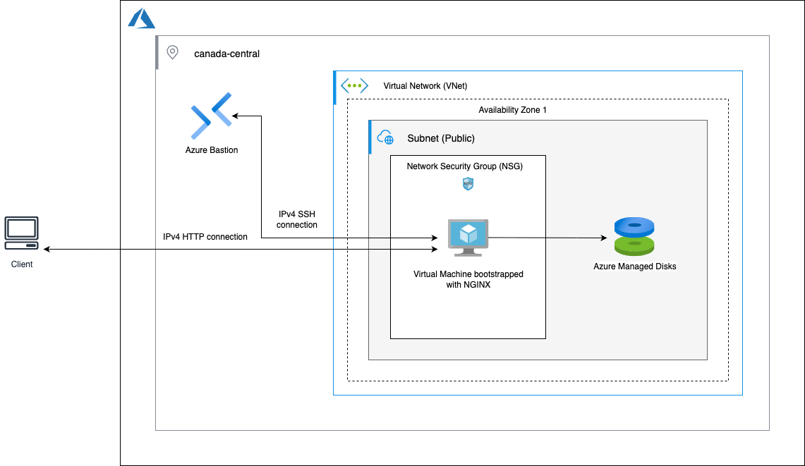

# Lab 2 – Working with Instances: An Azure VM Walkthrough

> **Azure equivalent of “Working with Instances: An Amazon EC2 Walkthrough.”**

**Level:** Beginner  
**Duration:** ~1 hour

---

## Overview

In this lab, you’ll create and secure an **Azure Virtual Machine (VM)**, configure network access, and deploy a simple web server.  
You’ll test access via **SSH** (through Azure Bastion) and the **browser**, and then clean up all resources.

---

## AWS → Azure Mapping

| AWS Service / Concept          | Azure Equivalent                |
| ------------------------------ | ------------------------------- |
| Amazon EC2 (virtual server)    | Azure Virtual Machine (VM)      |
| Amazon EBS (block storage)     | Azure Managed Disk              |
| EC2 Instance Connect (SSH web) | Azure Bastion / Serial Console  |
| EC2 Security Group             | Network Security Group (NSG)    |
| Default VPC & Subnet           | Virtual Network (VNet) & Subnet |
| Availability Zone              | Azure Availability Zone         |
| AWS Region                     | Azure Region                    |

---

## Learning Objectives

By the end of this lab, you will have:

- Understood **Azure Virtual Machines** and supporting resources
- Learned how to create and use **SSH keys** for authentication
- Configured **NSGs** for secure SSH (22) and HTTP (80) access
- Deployed an **Azure VM** with a **Managed Disk** in a **VNet/Subnet**
- Tested VM connectivity via **Azure Bastion** and **browser**
- Practiced cleaning up resources after the lab

---

## Technologies

- Azure Virtual Machines
- Managed Disks
- Virtual Network (VNet) & Subnet
- Network Security Group (NSG)
- Public IP, NIC
- Azure Bastion
- NGINX Web Server

---

## Architecture Diagram

**Azure Lab 2 Architecture**

The setup consists of:

- **Client** (browser/SSH client)
- **Azure Bastion** for SSH/HTTP access to the VM
- **Azure VM** running NGINX
- **Managed Disk** attached to the VM
- **NSG** allowing inbound SSH (22) and HTTP (80)
- **VNet & Subnet** providing network isolation
- **Availability Zone** within an **Azure Region**



---

## Cloud Lab Tasks

<details>
<summary>1. Introduction – Getting Started</summary>

- Sign in to the [Azure Portal](https://portal.azure.com).
- In the left-hand menu, click **Resource groups**, then **Create**.
- Fill in the form:
  - **Subscription:** Select your active subscription
  - **Resource group:** `rg-vm-lab`
  - **Region:** `Canada Central` (or your nearest region with Availability Zones)
- Click **Review & Create**, then **Create**.

This resource group will contain all lab resources.

</details>

---

<details>
<summary>2. Create a Network Security Group (NSG)</summary>

A **Network Security Group (NSG)** acts like a firewall. It will allow us to reach the VM via **SSH** and **HTTP**.

1. In the Azure Portal search bar, type **Network security groups**.
2. Click **Create**.
3. Fill in the form:
   - **Resource group:** `rg-vm-lab`
   - **Name:** `nsg-vm-lab`
   - **Region:** same as the resource group (e.g., `Canada Central`)
4. Click **Review & Create**, then **Create**.

#### Add inbound rules

1. Open the newly created NSG (`nsg-vm-lab`).
2. Under **Settings**, select **Inbound security rules** then **Add**.
3. Create two rules:

   - Rule 1 (SSH):

     - **Source:** Any
     - **Destination port ranges:** `22`
     - **Protocol:** TCP
     - **Action:** Allow
     - **Priority:** 1000
     - **Name:** `Allow-SSH`

   - Rule 2 (HTTP):
     - **Source:** Any
     - **Destination port ranges:** `80`
     - **Protocol:** TCP
     - **Action:** Allow
     - **Priority:** 1001
     - **Name:** `Allow-HTTP`

</details>

---

<details>
<summary>3. Create an SSH Key Pair</summary>

Instead of passwords, Azure uses **public key cryptography** for SSH.

- If you don’t have an SSH key already, create one locally:

```bash
ssh-keygen -t ed25519 -C "lab2" -f ~/.ssh/azure_lab2_key
```

This generates:

- Public key: `~/.ssh/azure_lab2_key.pub`
- Private key: `~/.ssh/azure_lab2_key`

- You’ll use the **public key** during VM creation.
- Keep the **private key** safe for SSH access.

</details>

---

<details>
<summary>4. Launch an Azure VM</summary>

1. In the Azure Portal, search for **Virtual machines**.
2. Click **Create**, then **Azure virtual machine**.
3. Fill in the **Basics** tab:

   - **Resource group:** `rg-vm-lab`
   - **Virtual machine name:** `vm-lab2`
   - **Region:** `Canada Central`
   - **Availability options:** Availability Zone → Zone 1
   - **Image:** Ubuntu Server 22.04 LTS
   - **Size:** Standard_B1s (low cost)
   - **Authentication type:** SSH public key
   - **Username:** `azureuser`
   - **SSH public key source:** Paste your public key (`~/.ssh/azure_lab2_key.pub`)
   - **Inbound ports:** None (we’ll rely on the NSG rules)

4. Go to the **Networking** tab:

   - **VNet/Subnet:** default or create new
   - **Public IP:** Enabled
   - **NIC network security group:** Select existing → `nsg-vm-lab`

5. Go to the **Advanced** tab:
   - In **User data**, paste this script to install NGINX:

```bash
#!/bin/bash
apt-get update -y
apt-get install -y nginx
systemctl enable --now nginx
echo "Hello from Azure VM Lab 2 - $(hostname)" > /var/www/html/index.html
```

6. Click **Review & Create**, then **Create**.

The VM will provision with NGINX installed and serving a test page.

</details>

---

<details>
<summary>5. Test the VM</summary>

#### Approach 1: Browser Test

1. Go to the VM’s **Overview** tab.
2. Copy the **Public IP address**.
3. Open `http://<Public-IP>` in your browser.
4. You should see the custom message:  
   **Hello from Azure VM Lab 2 - (hostname)**

---

#### Approach 2: Azure Bastion (Web SSH)

1. In the VM page, click **Connect** → **Bastion**.
2. Enter:
   - Username: `azureuser`
   - Private key: Upload your `azure_lab2_key` file.
3. Click **Connect**.
4. You’ll get a browser-based terminal.
5. Run:
   ```bash
   curl localhost:80
   ```
   This should return the same web page content.

---

#### Approach 3: Local SSH (Optional)

1. On your machine:

```bash
ssh -i ~/.ssh/azure_lab2_key azureuser@<Public-IP>
```

2. Verify NGINX is running:

```bash
systemctl status nginx
```

3. Fetch the test page:

```bash
curl localhost:80
```

</details>

---

<details>
<summary>6. Clean Up</summary>

To avoid charges, delete all resources:

**Azure Portal**

1. Go to **Resource groups** → select `rg-vm-lab`.
2. Click **Delete resource group**.
3. Type `rg-vm-lab` to confirm.

**Azure CLI**

```bash
az group delete -n rg-vm-lab --yes --no-wait
```

</details>

---

## Wrap Up

- You created and secured an **Azure VM**.
- You deployed **NGINX** and tested connectivity via **browser** and **Bastion SSH**.
- You mapped AWS concepts to Azure equivalents.
- You cleaned up resources.

Congratulations — you’ve completed **Lab 2: Working with Instances: An Azure VM Walkthrough.**
